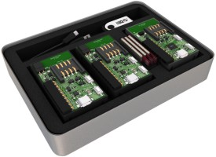

# [IQRFBB-10 Development Board](http://logimic.com/iqrfboard)

 
 

Powered for you by <a href="http://www.logimic.com" align="right">logimic.com</a>

IQRF development board helps you to design IQRF wireless devices like sensors and actuators. Just connect sensors, load software and you get fully working IQRF prototype of device.

## IQRF Board Repository layout

* [Getting Started with IQRFBB-10](documents/README.md) shows how to configure IQRF network, how to configure and connect IQRFBB-10 board into IQRF network and how to verify proper connectivity.
* [Application examples](documents/examples/README.md) are  hardware and software projects that you can use in your development for free. You are getting many working examples.
* [Documentation](documents/README.md#Documentation) like data sheets, drawings, guidelines etc...

## How to buy

**[Order.. IQRFBB-10](http://logimic.com/iqrfboard/index.html#form1-8)**
* Logimic IQRFBB-10 Development Board
* [TR-76DA](https://eshop.iqrf.org/products/detail/TR-76DA) transciever.
* Cabling
   

**[Order.. DS-START-04](https://iqrf.org/products/ds-start-04)**
You need this device if you do not have any working IQRF network.
   

## Licensing

All content in the repository is licensed via the [MIT license](https://opensource.org/licenses/MIT)
