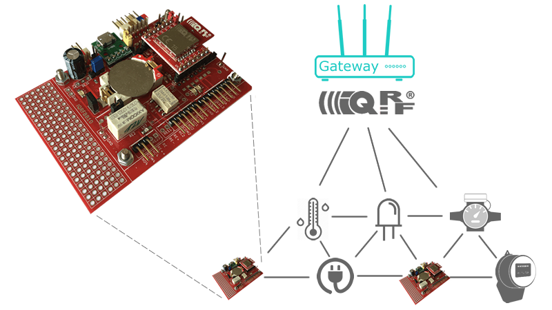

# [IQRFBB-10 Development Board](http://logimic.com/iqrfboard)

 
 

Powered for you by <a href="http://www.logimic.com" align="right">logimic.com</a>

IQRF development board helps you to design IQRF wireless devices like sensors and actuators. Just connect sensors, load software and you get fully working IQRF prototype of device.

[Official project pages...](http://logimic.com/iqrfboard)

[Getting Started and Documentation pages...](http://logimic.com/iqrfboard/book/)

## Licensing

All content in the repository is licensed via the [MIT license](https://opensource.org/licenses/MIT)
