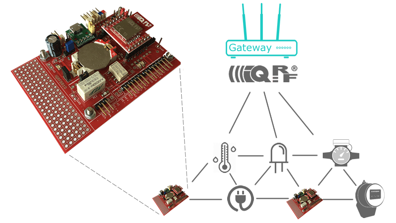
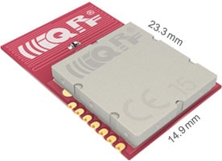

 

Powered for you by <a href="http://www.logimic.com" align="right">logimic.com</a>

# [IQRFBB-10 Development Board](http://logimic.com/iqrfboard)

IQRF development board helps you with your design of IQRF end devices (nodes) both sensors, actuators or others. Just connect sensors, load software and fully working IQRF node is here.

## How to buy

**[Order.. IQRFBB-10](http://logimic.com/iqrfboard/index.html#form1-8)**
Logimic IQRFBB-10 Development Board (IQRF transciever is not included).
   

**[Order.. TR-76DA](http://logimic.com/iqrfboard/index.html#form1-8)**
IQRF transciever module for pin out.
   

**[Order.. DS-START-04](https://iqrf.org/products/ds-start-04)**
You need this device if you do not have any working IQRF network.
  

## IQRF Board Repository layout

* [Quick Start on Wiki](https://github.com/logimic/iqrfboard/wiki) of the repository
* Many Examples how to create end devices from the board
* [Data sheet..](files/datasheet/IQRFBB10-Datasheet.pdf)
* [Schema of connectors, jumpers and diods..](files/datasheet/IQRFBB10-Connectors.pdf)
* [Detail hardware scheme..](files/datasheet/IQRFBB10_doc_sch.pdf)

## Licensing

All content in the repository is licensed via the [MIT license](https://opensource.org/licenses/MIT)
