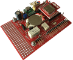
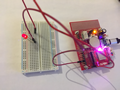

# Examples with IQRFBB-10

# Standard Things

Standard things have pre-defined JSON API and all IQRF gateways know them.  If you implement your device in TR module as **Standard Light**, **Standard Binary Output**, **Standard Sensor** and more you have ensured compatibility of your device with IOT world.

## 1. Light

This example shows how to create "Standard light" from your board which means that entire world will know that your device is just a light and will be able to manage it (turn on/off, dim, get status and more). Your hardware design on the top of board is not limited.
[Enter example...](examples-docs/standard-light/README.md)

## 2. Binary Output

This example shows how to create one or more standard binary outputs on the board.
[Enter example..](examples-docs/standard-bin-output/README.md)

## 2. Bi-stable Relay

This example shows how to manage bi-stable relay on board via standard messages.
[Enter example..](examples-docs/standard-bistable-relay/README.md)

## 3. Photorezistor Sensor

This example shows how to create standard photorezistor sensor.
[Enter example..](examples-docs/standard-photorezistor/README.md)

## 4. Thermistor Sensor

This example shows how to create standard thermistor sensor.
[Enter example..](examples-docs/standard-thermistor/README.md)

# Pure DPA messages

## 1. Digital Output

This example shows how to set HI/LO digital output. The DO has connected external LED.
[Enter example..](examples-docs/digital-output/README.md)

## 2. Digital Input

This example explains how to detect digital input on board PIN.
[Enter example..](examples-docs/digital-input/README.md)

## 3. Hall Magnetic Sensor

This example shows how to connect Hall Magentic Sensor with the board and detect event.
[Enter example..](examples-docs/dpa-hall/README.md)

## 4. Motion detection (ePir)

This example shows how to connect motion sensor ePir to the board and detect event.
[Enter example..](examples-docs/dpa-epir/README.md).

## 5. Bi-stable relay on board

This example shows how to switch bi-stable relay on board.
[Enter example..](examples-docs/dpa-bistable-relay/README.md)

## 6. HTU21D - Temp & Humidity

This example shows how to connect HTU21D Temperature and Humidity sensor to board.
[Enter example..](examples-docs/dpa-htu21d/README.md)

# IQRF Embedded things

## 1. Embedded LED on board

First hello world example which turns on/off RED and GREEN diods on the IQRFBB-10 board.
[Enter example...](examples-docs/embedded-led/README.md)
