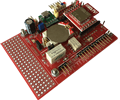
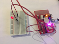
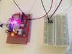
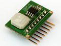
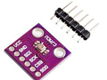
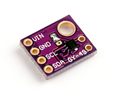

# Basic examples
## 1. LED2, LED3 on board

First hello world example which turns on/off RED and GREEN diods on the IQRFBB-10 board.
[Enter example...](examples/example-led23/README.md)

## 2. Digital Output

This example shows how to set HI/LO digital output. The DO has connected external LED.
[Enter example..](/examples/example-do)

## 3. Digital Input

This example explains how to detect digital input on board PIN.
[Enter example...](/examples/example-di),

# Standard Things

Standard things have pre-defined JSON API and all IQRF gateways know them.  If you implement your device in TR module as **Standard Light**, **Standard Binary Output**, **Standard Sensor** and more you have ensured compatibility of your device with IOT world.

## 1. Standard Light

This example shows how to create "Standard light" from your board which means that entire world will know that your device is just a light and will be able to manage it (turn on/off, dim, get status and more). Your hardware design on the top of board is not limited.
[Enter example...](/examples/example-standardLight)

## 2. Standard Binary Output

This example shows how to create one or more standard binary outputs on the board.
[Enter example..](/examples/example-standardBinOutput)

# Others..

## 1. Hall Magnetic Sensor

[/example-hall](example-hall), this example shows how to connect Hall Magentic Sensor with the board and detect event.

## 2. Motion detection (ePir)

[/example-ePir](example-ePir), this example shows how to connect motion sensor ePir to the board and detect event.

## 3. Bi-stable relay on board

[/example-bistable-relay](example-bistable-relay), this example shows how to switch bi-stable relay on board.

## 4. HTU21D - Temp & Humidity

Comming soon HTU21D...

[/example-HTU21D](example-HTU21D), this example shows how to connect HTU21D Temperature and Humidity sensor to board.

## 5. GY-BME280 - Temp & Baro

Comming soon GY-BME280...
<!--
[/example-GY-BME280](example-GY-BME280), this example shows how to connect GY-BME280 Temperature and Barometric pressure sensor to board.
-->

## 6. Ambient Light Sensor

Comming soon GY49...
<!--
[/example-GY-49](example-GY-49), this example shows how to connect GY-BME280 Temperature and Barometric pressure sensor to board.
-->
