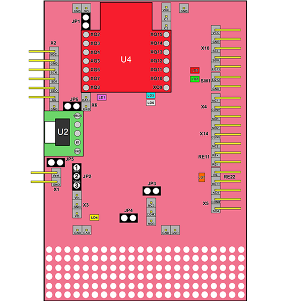
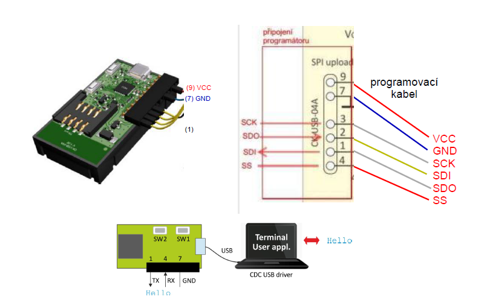
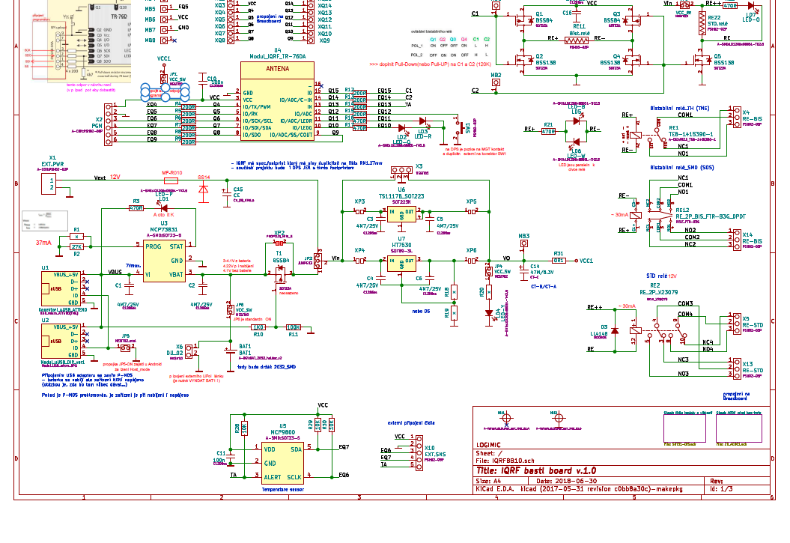

# IQRFBB10 Data Sheet

**Revision:** 1.0, Nov-2018

## 1. Description

IQRFBB10 is development board for prototyping of end devices (nodes) of IQRF network. Board includes socket for IQRF transciever module plugin and enables connection of any sensors, acttuators via DI, DIO, or I2C interfaces. Software operation of sensors and data transfer is performed in MCU of IQRF radio transciever module.

## 2. Specification

|                                           |                                                     |
| ----------------------------------------- | --------------------------------------------------- |
| **Power supply**                          |                                                     |
| - Accumulator                             | LIP552240, 400 mAh, nominal voltage 3.7 V           |
| - Via micro USB connector (with charging) | 4.4 V to 6.0 V DC                                   |
| - External power supply                   | 5-12 V                                              |
| - External accumulator                    | pres X6, nominal voltage 3.7 V                      |
| **Supply current**                        |                                                     |
| -        ???                              |                                                     |
| **Temperature operating**                 |                                                     |
| - Accumulator not charged                 | -20°C to +60°C                                      |
| - Accumulator charged                     | 0 °C to +45 °C                                      |
| **Storage Temperature**                   | -20°C to +20°C (1 year), +10°C to +25°C recommended |
| **Supported TR modules**                  | TR-76DA and similar                                 |
| **Dimensions**                            | 60 mm x 85 mm x 23 mm                               |
| **Weight**                                | 30g                                                 |
|                                           |                                                     |

## 3. Simple scheme

_Fig1. Simple schema of IQRF BB-10 board_

## 4. Features

| **Name** | **Type**         | **Description**       |
|:-------- |:---------------- | --------------------- |
| U4       |                  | IQRF TR module socket |
| Bat1     | LIR2032          | Chargeable battery    |
| USB      | uUSD_to_DIP      | PCB adapter           |
| Bist-rel | ME-6C-L1-03-1a1b | Bi-stable relay 3V    |
| RE-STD   | IM-HICPD         | Standard releay       |
|          |                  |                       |

## 5. PINs specification

| **Pin** | **Name** | **Description**                                     |
|:------- |:-------- | --------------------------------------------------- |
| VCC     |          | Power supply voltage                                |
| GND     |          | Ground                                              |
| SCL     |          | I2C clock                                           |
| SDA     |          | I2C data                                            |
| EQ13    | TA       | General input only pin                              |
| EQ12    | SW1      |                                                     |
| GND     | SW1      | Ground                                              |
| NC1     |          | Bi-stable relay TH                                  |
| COM1    |          | Bi-stable relay TH                                  |
| NO1     |          | Bi-stable relay TH                                  |
| NO2     |          |                                                     |
| COM2    |          | Bi-stable relay SMD                                 |
| NC2     |          | Bi-stable relay SMD                                 |
| RE+     |          | Output for power supply of Bi-stable relay (+/- 3V) |
| RE-     |          | Output for power supply of Bi-stable relay (+/- 3V) |
| RE      |          | Output for power supply of Bi-stable relay          |
| RE+++   |          | Output for power supply of Bi-stable relay          |
| NC4     |          | Standard relay                                      |
| COM4    |          | Standard relay                                      |
| NO4     |          | Standard relay                                      |
| MB1     | C1       |                                                     |
| MB2     | C2       |                                                     |
| MB3     | VO       |                                                     |
| MB4     |          |                                                     |
| MB5     | VCC      |                                                     |
| MB6     |          |                                                     |
| MB7     |          |                                                     |
| MB8     |          |                                                     |
| X13     |          | Contact of Standard relay (paket_2)                         |
| PGM 1   | VCC      |                                                     |
| PGM 2   | GND      |                                                     |
| PGM 3   | SCK      |                                                     |
| PGM 4   | SDI      |                                                     |
| PGM 5   | SDO      |                                                     |
| PGM 6   | SS       |                                                     |

### IQRF module PIN mapping

| **PIN** | **IQRF PIN** |     |
| ------- | ------------ | --- |
| XQ2     | GND          |     |
| XQ3     | VCC          |     |
| XQ4     | Q4           |     |
| XQ5     | Q5           |     |
| XQ6     | Q6           |     |
| XQ7     | Q7           |     |
| XQ8     | Q8           |     |
| XQ9     | Q9           |     |
| XQ10    | Q10          |     |
| XQ11    | Q11          |     |
| XQ12    | Q12          |     |
| XQ13    | Q13          |     |
| XQ14    | Q14          |     |
| XQ15    | Q15          |     |
|         |              |     |

## 6. Jumpers

| **Jumper** | **Description** | **Description**                                                                                                             |
|:---------- |:--------------- | --------------------------------------------------------------------------------------------------------------------------- |
| JP1        | VCC_SW          | Enable connection of local source 3V. Note: connect local source after un-plug of programmer!                               |
| JP2        |                 | Power cupply choise   1-2: LiPol/USB adapter 5V (board works withouth battery)  2-3: external power supply 5-16V z X1 |
| JP3        |                 |                                                                                                                             |
| JP4        | VCC_SW          | Connects indication of powwer supplyLD4-Y (3V)                                                                              |
| JP5        |                 | Host_mode at Android devices if possible                                                                                    |
| JP6        | VCC_SW          | Connects battery to power supply                                                                                            |
| X6         |                 | Connects external Lipol battery                                                                                             |
|            |                 |                                                                                                                             |

## 7. Diods

| **Diod** | **Name** | **Description**                 |
|:-------- |:-------- | ------------------------------- |
| LD1      | LED-P    |                                 |
| LD2      | LED-G    |                                 |
| LD3      | LED-R    |                                 |
| LD4      | LED-Y    | Indication of power supply (3V) |
| LD5      | LED-B    |                                 |
| LD6      | LED-W    |                                 |
| LD7      | LED-O    |                                 |
|          |          |                                 |

## 8. Operation conditions

TODO

## 9. Programmer connection

_Fig2. programmer connection with IQRF BB-10 board_

* Connect with **CK-USB-04A** programmer.
* No TR module in programmer.

## 10. Detail scheme

_Fig3. Detail scheme of IQRF BB-10 board_

## 11. Contacts

[www.logimic.com](http://www.logimic.com)
