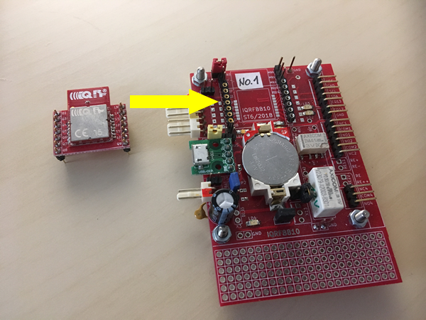
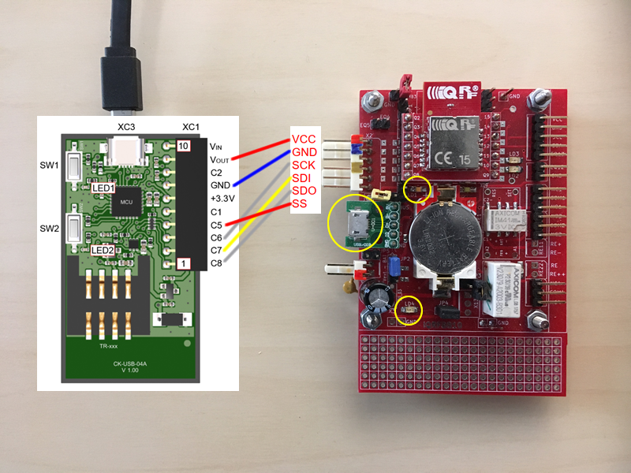
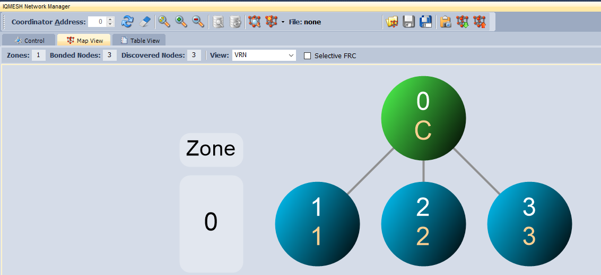
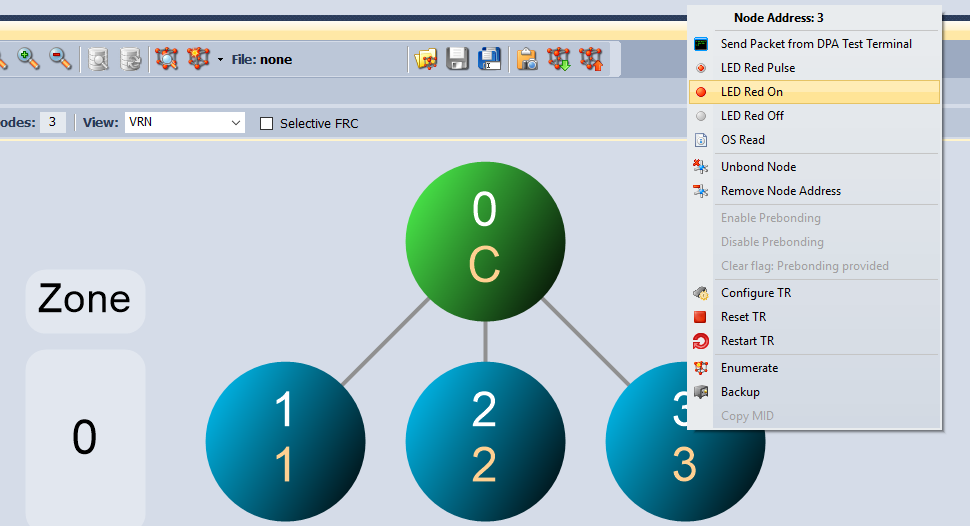
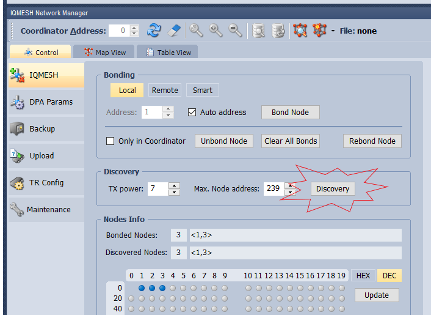

# Getting Started with IQRFBB-10

IQRFBB-10 board is a node of IQRF network. In this tutorial we will demonstrate how to connect board into IQRF network and make any sensor or actuator from it.
Then we will connect the device to IQRF gateway software and show you many examples how to read or send data from your software.

## Links
* [IQRFBB-10 Presentation & Orders](http://logimic.com/iqrfboard)
* [IQRFBB-10 GitHub pages](https://github.com/logimic/iqrfboard)
* [IQRFBB-10 Data Sheet](files/datasheet/IQRFBB10-Datasheet.pdf)
* [IQRFBB-10 Board Schema](files/datasheet/IQRFBB10-Connectors.pdf)
* [IQRFBB-10 Hardware Drawing](files/datasheet/IQRFBB10_doc_sch.pdf)
* [TR-76D Data Sheet](files/iqrf/TR-76D_datasheet.pdf)

## Prepare IQRF network
Firs check IQRF network around you. If you do not have any, let's start with [SetupIqrfNetwork](SetupIqrfNetwork.md).

## Assemble Board

* JP1: OFF
* JP6: OFF
* Insert IQRF TR into board

## Connect Programmer

1. Unplug USB cable from CK-USB-04A

2. Make wiring

3. Plug micro-USB to IQRFBB-10 to power-on. Indication LD1=ON (charging battery), LD4=ON

4. Plug micro-USB to CK-USB-04A

## Load Software
If we are talking about software loading, we always mean loading to IQRF transciever TR-76D mounted on IQRFBB-10. Now we will configure board (transciever) as a node of IQRF network.

1. Make sure you made a proper wiring and both USB power sources (programmer + board) are on.

2. Now you can upload node configuration as described in [preparation of your IQRF network chapter](SetupIqrfNetwork.md#configure-nodes). **Do not put any IQRF module into CK-USB-04A programmer SIM!**

3. Uploading data into transciever is sihnalized by LD3 diod on IQRFBB-10 board.

4. Unplug micro USB of CK-USB-04A programmer

5. Unplug micro USB of IQRFBB-10 board.

6. Unplug CK-USB-04A from IQRFBB-10.

## Bond to Network
Bonding IQRF nodes is generally [described here...](SetupIqrfNetwork.md#run-network), bonding IQRFBB-10 board goes this way:

1. Turn on battery power **JP6 = ON**. Diod indicating power on is **LD4 = ON**.

2. Turn TR module power **JP1 = ON**.

3. Open IDE, then menu start Tools/IQMESH Network Manager and fill out the dialogue as shown (TX power, Auto address, ...).

4. Then pres **Clear All Bonds** for remove any previous bonded modules. Red diods of modules are blinking, at IQRFBB-10 it is diod **LD3**.

5. Then pres **Bond Node** and during bonding period press and hold SW1 button at one node until green diod turns on. Repeat for each node. At IQRFBB-10 the SW1 is an external contact **EQ12, GND**, red diod is **LD3** and green diods is **LD2**.

6. Now you should see yellow spots indicating successful bonding. Now click **Discovery** and spots are in blue.

7. Switch in IDE to **Map View** and you should see node structure something like in the picture.

8. Try to turn on **LD3 (RED diod)** on IQRFBB-10 board. Click rigt mouse button on spot indicating board (it depends on the bonding order) and select **LED Red On**. Then the **LD3 = ON** on the board.

## Check Operability
Now you have fully configured IQRFBB-10 board. You can check operability this way:

1. Battery power turn on/off is always done via **JP6**. When you power board on, then it is always automatically connected to the IQRF network (if you properly did all steps above).

2. For checking of connectivity open **IDE** and in **IQMESH Network Manager**, view **Control** click **Discovery** button. Working nodes are displayed in blue spots, previously bonded but inactive are shown as yellow spots.

3. Switch to **Map View**, find IQRF-BB10 node (one of blue spheres) and try to turn on **LD3 (RED diod)** on IQRFBB-10 board. Right click mouse button on spot indicating board and select **LED Red On**. Then the **LD3 = ON** on the board.

## Examples
Then turn the IQRFBB-10 board into any wireless sensor or actuator [with many examples](examples/README.md)
