# Setup IQRF Network

Start building your IQRF network with **DS-START-04** development kit.

## Links
* [Order here](https://iqrf.org/products/ds-start-04)
* [The Content of the Starter Kit](files/iqrf/README_150909.pdf)
* [IQRF Quick Start Guide](https://github.com/logimic/iqrfboard/blob/master/files/iqrf/Quick_Start_Guide_IQRF_181018.pdf)
* [CK-USB-04A](https://github.com/logimic/iqrfboard/blob/master/files/iqrf/User_Guide_CK-USB-04A_171109.pdf), [online page...](https://iqrf.org/products/development-tools/development-kits/ck-usb-04a)
* [...check for updates ](https://iqrf.org/products/ds-start-04)

## Install IDE

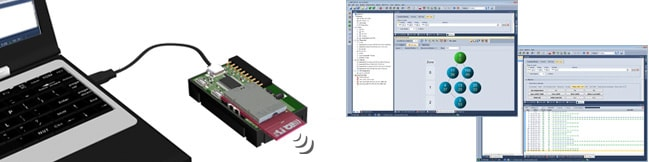

IDE is a basic programming tool for IQRF devices. Download and install [https://www.iqrf.org/technology/iqrf-ide/iqrf-ide-gui](https://www.iqrf.org/technology/iqrf-ide/iqrf-ide-gui)

## Install IQRF Startup Package

Download [IQRF Startup package](https://www.iqrf.org/support/download&kat=34&ids=82) and unpack anywhere to your hard drive.

## First Start

* Start your IDE, navigate to your installed **IQRF Startup package** e.g. _d:\IQRF_OS403_7xD\Examples\DPA\StartUp_ and open **HWP-demo.iqrfprj**

* Insert any IQRF module to programmer [CK-USB-04A](https://iqrf.org/products/development-tools/development-kits/ck-usb-04a) and connect to PC via USB.

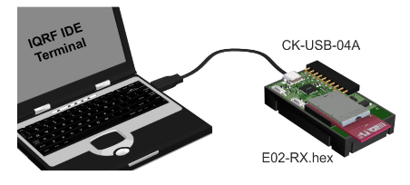

* In IDE you will probably see **USB device not connected** in bottom panel.

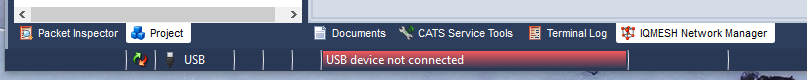

* Go to menu **Tools/USB Classes/Swith to Custom Device mode** and select listed COM (USB) port. If you do not see any port please follow troubleshooting on IQRF support. You need driver update. Successful selection will show dialogue like this.

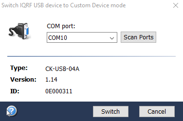

* Click **Switch** and the bottom panel will show **Module ready - communication mode**

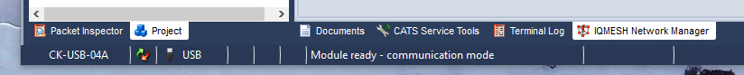

* It might show dialogue about firmware update, then click **Yes**.

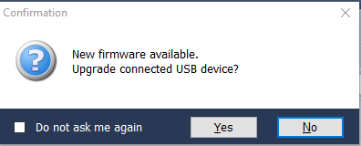

* Click **Upload** button, wait for firmware update, then press **Close**.

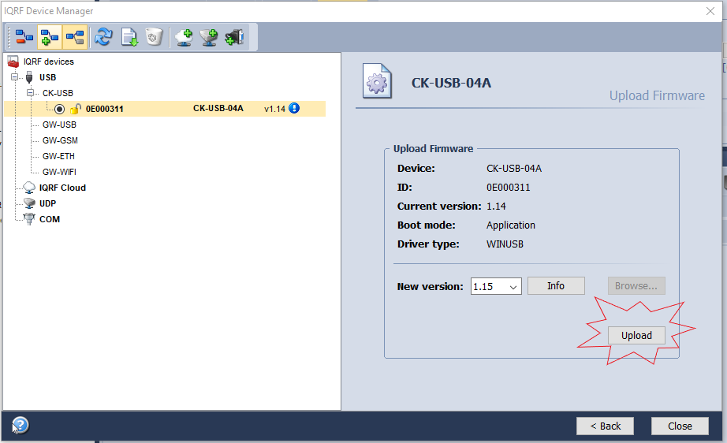

## Configure Coordinator

A Concentrator is the node connected with PC or Gateway gathering data from all nodes.
**! When you insert or remove TR from holder, always press SW2 button (nearer to SIM slot). It breaks power.**

* In left panel check **HWP-Coordinator-...iqrf** file

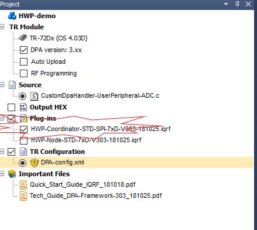

* Double click on **DPA-config.xml** in left panel. Set items in dialogue as picture shows and click **Upload** button.

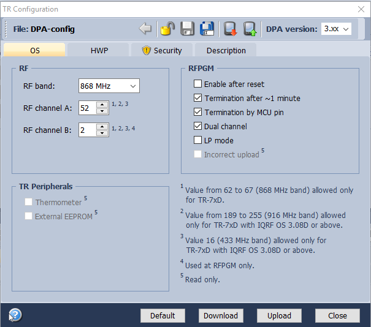

* In menu select **Programming/Upload/Upload Selected Items**. If the system complains that uploading version is not for the connected TR module, please upgrade OS in module. See **Upgrade OS in TR module** section.

## Configure Nodes

A Node is a module communication within mesh with Concentrator.
**! When you insert or remove TR from holder, always press SW2 button (nearer to SIM slot). It breaks power.**

* Insert TR module to be node into programmer

* In left panel of IDE check **HWP-Node-STD-...**

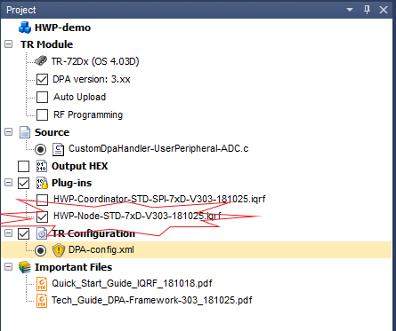

* Keep the **DPA-config.xml** settings as previously at concentrator.

* Upload all your nodes. If the system complains that uploading version is not for the connected TR module, please upgrade OS in module. See **Upgrade OS in TR module** section.

## Upgrade OS in modules

* In menu select **Tools/Change IQRF OS Wizard** and follow wizard.

* Use **SPI** as upload method.

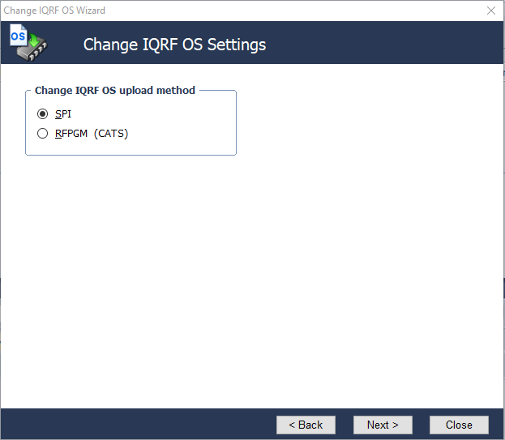

* Then select version to be uploaded

* **!If your modules are older you might need to repeat the upgrade OS more times**

## Run Network

* Insert coordinator configured TR module to programmer CK-USB-04A and nodes to other DK-EVAL-04A modules.

* In IDE in menu start **Tools/IQMESH Network Manager** and fill out the dialogue as shown (TX power, Auto address, ...).

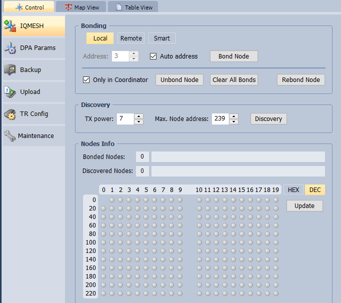

* Then pres **Clear All Bonds** for remove any previous bonded modules. Red diods of modules are blinking.

* Then pres **Bond Node** and during bonding period press and hold SW1 button at one node until green red turns on. Repeat for each node.

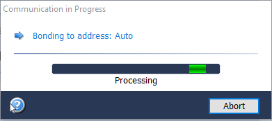

* Now you should see two spots indicating successful bonding. Now click **Discovery** and spots are in blue.

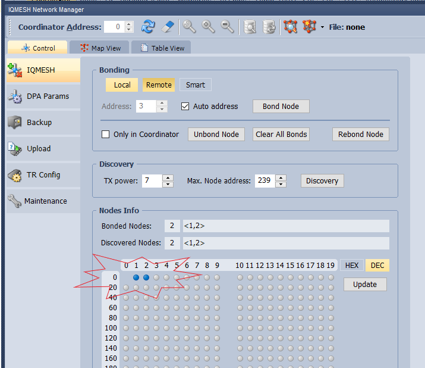

* Switch in IDE to **Map View** and you should see node structure

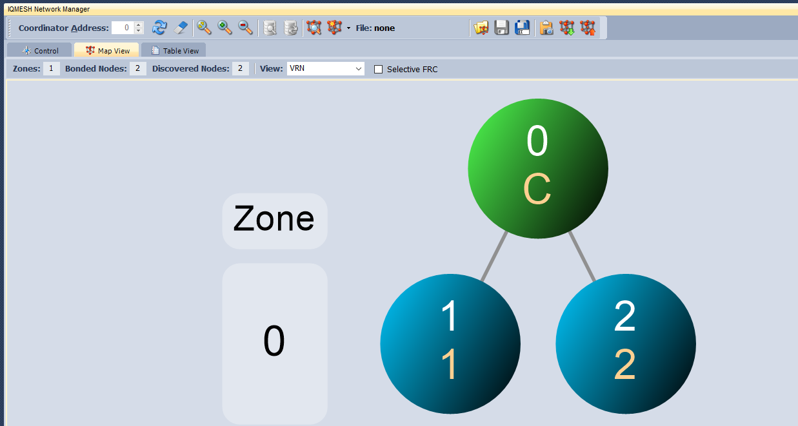

* Click right mouse button on node 1 and select **LED Red On**

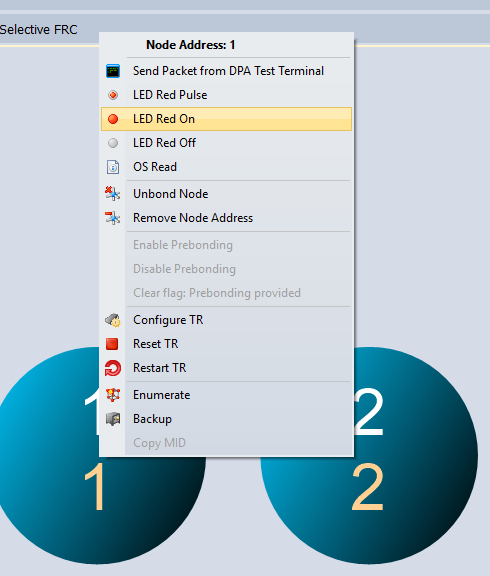

* Now you can see that the **RED LED** of node 1 is on. In similar way you can turn-off or play with LEDs.

## Send DPA messages

Direct Peripheral Access (DPA) protocol is a simple byte-oriented protocol used to control nodes and network. Detail description of [DPA Framework](https://www.iqrf.org/DpaTechGuide/)

* DPA can be sent via IDE. Open **Terminal** and click **Set LEDR on** which prefills data into **Data to send** fields. Change only **NADR=0001** which indicates node 1 and click **Send**.

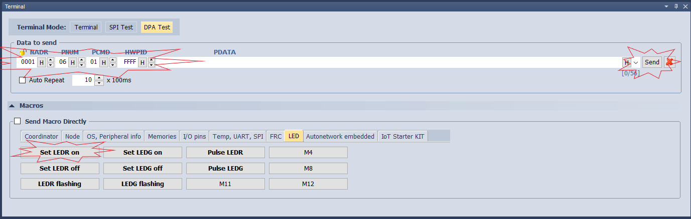

* This DPA command turned on RED diod on node 1.
* You can define any other DPA messages.
