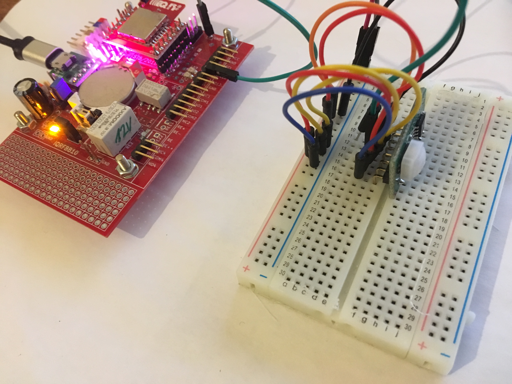
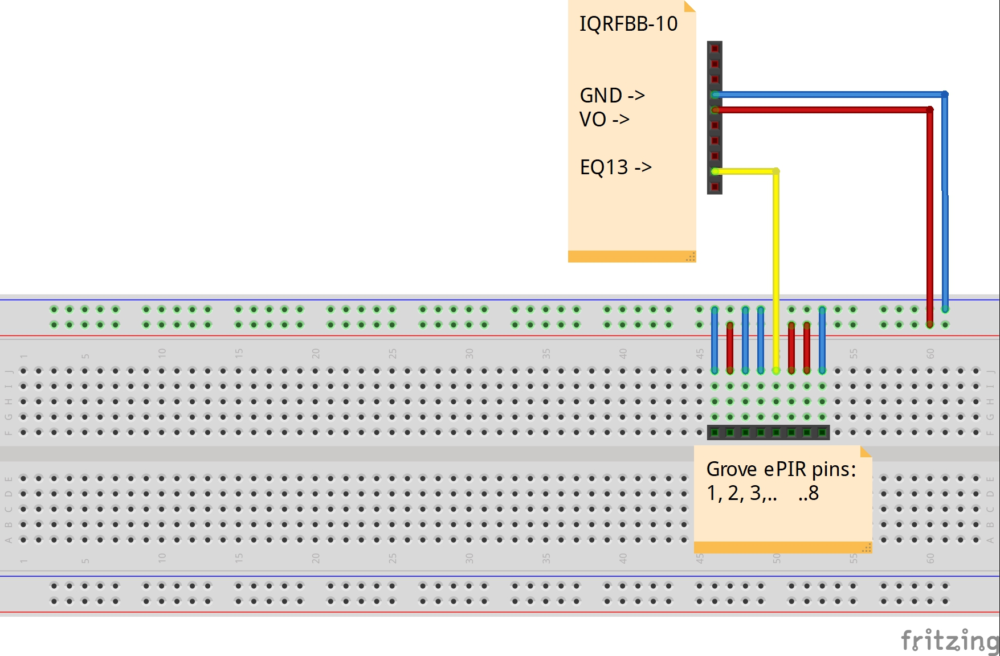

# Motion Sensor (ePir)

This example shows how to connect [Zilog ePIR – SparkFub – SEN-09587](https://www.sparkfun.com/datasheets/Sensors/Proximity/SEN-09587-PS0284.pdf) to the board.

## Prerequisities

1. **IQRFBB-10** bonded in working IQRF network. More in [GettingStarted with IQRFBB-10](https://github.com/logimic/iqrfboard/wiki)
2. **IQRF Gateway Daemon** running. More in [IQRF Gateway Daemon](https://github.com/logimic/iqrfboard/wiki/IQRF-Gateway-Daemon)
3. **Python 3.6 with WebSockets module**. More in [Python 3.6 WbSockets example](https://github.com/logimic/iqrfboard/wiki/Get-IQRF-with-your-software#python-36-websocket-example)

## Hardware wiring

_Fig.: IQRFBB10 schema_

_Fig.: External LED wiring_

Connect VO, EQ13 and GRND pins with [Zilog ePIR – SparkFub – SEN-09587](https://www.sparkfun.com/datasheets/Sensors/Proximity/SEN-09587-PS0284.pdf).

## Software

* We use Standard DPA handler already loaded in board TR module.
* Testing software:
    - Set EQ13 as DI. EQ13 is **Q13/RE3** pin on TR-76DA.
    - Read all DI in the loop
        - Parse response and make decision

### API JSON message

We will use pure DPA messages handled via [Daemon JSON API](https://docs.iqrfsdk.org/iqrf-gateway-daemon/):

* [RawHdp request  v1-0-0](https://apidocs.iqrf.org/iqrf-gateway-daemon/json/#iqrf/iqrfRawHdp-request-1-0-0.json), [..example](https://apidocs.iqrf.org/iqrf-gateway-daemon/json/iqrf/examples/iqrfRawHdp-request-1-0-0-example.json)
* [RawHdp response  v1-0-0](https://apidocs.iqrf.org/iqrf-gateway-daemon/json/#iqrf/iqrfRawHdp-response-1-0-0.json), [..example](https://apidocs.iqrf.org/iqrf-gateway-daemon/json/iqrf/examples/iqrfRawHdp-response-1-0-0-example.json)

**DPA commands:**

| NADR | PNUM | PCMD | HWPID |  PDATA   | What                       |
|:----:|:----:|:----:|:-----:|:--------:| -------------------------- |
| XXXX |  09  |  00  | FFFF  | 10.08.08 | Set RE3 (Address E3) as DI |
| XXXX |  09  |  02  | FFFF  |          | Read all DI pins           |

* _NADR: must be your address of IQRFBB-10 in IQRF network._
* _Numbers in table are in hex format._

### Testing Software

The link [dpa-epir.py](https://github.com/logimic/iqrfboard/blob/master/examples/dpa-epir.py).
