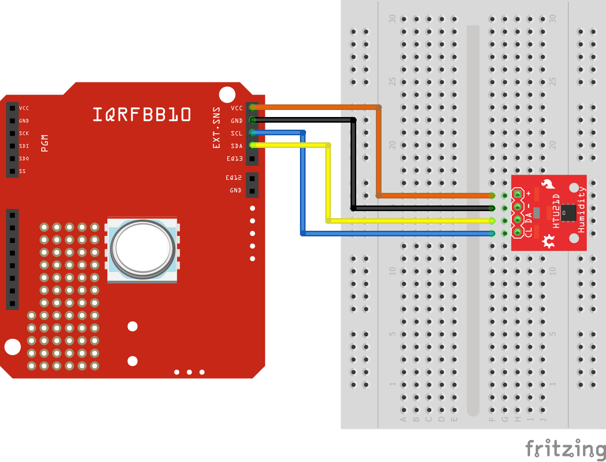

# Temperature & Humidity Sensor

This example shows how to connect [HTU21D](http://wiki.keyestudio.com/index.php/Ks0020_keyestudio_Hall_Magnetic_Sensor) with the board and measure temperature and humidity.

## Links

* [HTU21D Datasheet](https://www.te.com/commerce/DocumentDelivery/DDEController?Action=showdoc&DocId=Data+Sheet%7FHPC199_6%7FA6%7Fpdf%7FEnglish%7FENG_DS_HPC199_6_A6.pdf%7FCAT-HSC0004)

## Prerequisities

1. **IQRFBB-10** bonded in working IQRF network. More in [GettingStarted with IQRFBB-10](https://github.com/logimic/iqrfboard/wiki)
2. **IQRF Gateway Daemon** running. More in [IQRF Gateway Daemon](https://github.com/logimic/iqrfboard/wiki/IQRF-Gateway-Daemon)
3. **Python 3.6 with WebSockets module**. More in [Python 3.6 WbSockets example](https://github.com/logimic/iqrfboard/wiki/Get-IQRF-with-your-software#python-36-websocket-example)

## Hardware wiring

_Fig. IQRFBB10 schema_

_Fig. External LED wiring_

## Software

### Custom DPA Handler

We use Custom DPA Handler [dpa-htu21d.c](https://github.com/logimic/iqrfboard/blob/master/examples/dpa-htu21d.c) in this repo. Copy the file into IQRF SDK folders and load to TR module as [described here](../../SetupIqrfNetwork.md#load-custom-dpa-handler).

### API JSON message

We will use pure DPA messages handled via [Daemon JSON API](https://docs.iqrfsdk.org/iqrf-gateway-daemon/):

* [RawHdp request  v1-0-0](https://apidocs.iqrf.org/iqrf-gateway-daemon/json/#iqrf/iqrfRawHdp-request-1-0-0.json), [..example](https://apidocs.iqrf.org/iqrf-gateway-daemon/json/iqrf/examples/iqrfRawHdp-request-1-0-0-example.json)
* [RawHdp response  v1-0-0](https://apidocs.iqrf.org/iqrf-gateway-daemon/json/#iqrf/iqrfRawHdp-response-1-0-0.json), [..example](https://apidocs.iqrf.org/iqrf-gateway-daemon/json/iqrf/examples/iqrfRawHdp-response-1-0-0-example.json)

**DPA commands:**

| NADR | PNUM | PCMD | HWPID | PDATA | What                      |
|:----:|:----:|:----:|:-----:|:-----:| ------------------------- |
| XXXX | 0x20 |  00  |   -   |       | Get user periphery status |

* _NADR: must be your address of IQRFBB-10 in IQRF network._
* _Numbers in table are in hex format._

### Testing Software

The link [dpa-htu21d.py](https://github.com/logimic/iqrfboard/blob/master/examples/dpa-htu21d.py).
