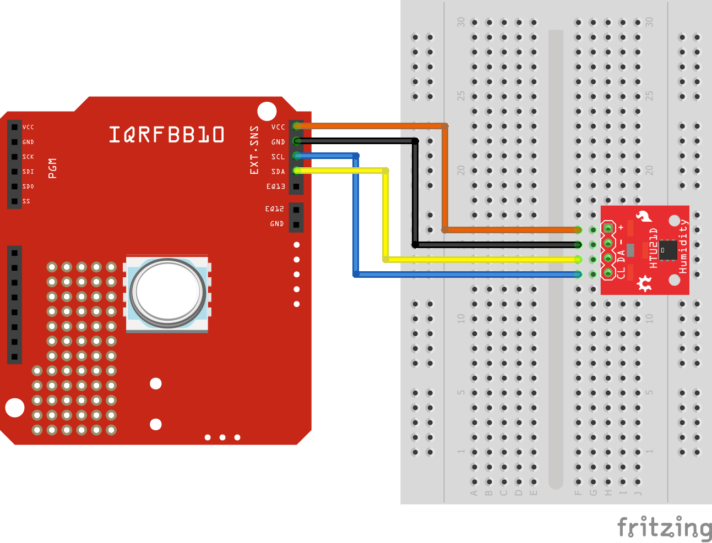

# Temperature & Humidity Sensor

This example shows how to connect [HTU21D](http://wiki.keyestudio.com/index.php/Ks0020_keyestudio_Hall_Magnetic_Sensor) with the board and measure temperature and humidity.

## Links

* [HTU21D Datasheet](https://www.te.com/commerce/DocumentDelivery/DDEController?Action=showdoc&DocId=Data+Sheet%7FHPC199_6%7FA6%7Fpdf%7FEnglish%7FENG_DS_HPC199_6_A6.pdf%7FCAT-HSC0004)
* [IQRFBB-10 Datasheet](../../IQRFBB10-Datasheet.md)

## Prerequisities

1. **IQRFBB-10** bonded in working IQRF network. More in [GettingStarted with IQRFBB-10](https://github.com/logimic/iqrfboard/wiki)
2. **IQRF Gateway Daemon** running. More in [IQRF Gateway Daemon](https://github.com/logimic/iqrfboard/wiki/IQRF-Gateway-Daemon)
3. **Python 3.6 with WebSockets module**. More in [Python 3.6 WbSockets example](https://github.com/logimic/iqrfboard/wiki/Get-IQRF-with-your-software#python-36-websocket-example)

## Hardware wiring


_Fig. IQRFBB10 schema_



_Fig. External LED wiring_

## Software

### Custom DPA Handler

We use Custom DPA Handler [CustomDpaHandler-HTU21D-i2c.c](CustomDpaHandler-HTU21D-i2c.c) in this repo. Copy the file into IQRF SDK folders and load to TR module as [described here](../../SetupIqrfNetwork.md#load-custom-dpa-handler).

```cpp
// ***********************************************************************************
//   Custom DPA Handler code example - User peripheral implementation - i2c          *
// ***********************************************************************************
// Copyright (c) Logimic, s.r.o.
//
// File:    $RCSfile: CustomDpaHandler-HTU21D-i2c.c,v $
// Version: $Revision: 1.0 $
// Date:    $Date: 2018/08/25 18:00:00 $
//
// Revision history:
//   2015/08/05  Release for DPA 3.02
//
// *********************************************************************

// Online DPA documentation http://www.iqrf.org/DpaTechGuide/

// This example implements the user peripheral reading from HTU21D
// PNUM = 0x20 and PCMD = 0 returns 2 bytes with result read from HTU21D
// Based on example DDC-SE-01-i2c.c

// Default IQRF include (modify the path according to your setup)
#include "IQRF.h"

// Default DPA header (modify the path according to your setup)
#include "DPA.h"
// Default Custom DPA Handler header (modify the path according to your setup)
#include "DPAcustomHandler.h"

//############################################################################################

void i2c_init();
void i2c_shutdown();
void i2c_waitForIdle();
void i2c_start();
void i2c_repStart();
void i2c_stop();
uns8 i2c_read( bit ack );
void i2c_write( uns8 i2cWriteData );

//#define I2C_ADR         	0b10010110
#define I2C_ADR         	0x40
#define PWR_SENSOR_TRIS 	TRISC.7
#define PWR_SENSOR_IO   	LATC.7

#define TRIGGER_TEMP_MEASUREMENT 0xE3
#define TRIGGER_WRITE						 0x80
#define TRIGGER_READ						 0x81

// Must be the 1st defined function in the source code in order to be placed at the correct FLASH location!
//############################################################################################
bit CustomDpaHandler()
//############################################################################################
{
  // Handler presence mark
  clrwdt();

  // Detect DPA event to handle
  switch ( GetDpaEvent() )
  {
	// -------------------------------------------------
	case DpaEvent_Interrupt:
	  // Do an extra quick background interrupt work
	  // ! The time spent handling this event is critical.If there is no interrupt to handle return immediately otherwise keep the code as fast as possible.
	  // ! Make sure the event is the 1st case in the main switch statement at the handler routine.This ensures that the event is handled as the 1st one.
	  // ! It is desirable that this event is handled with immediate return even if it is not used by the custom handler because the Interrupt event is raised on every MCU interrupt and the �empty� return handler ensures the shortest possible interrupt routine response time.
	  // ! Only global variables or local ones marked by static keyword can be used to allow reentrancy.
	  // ! Make sure race condition does not occur when accessing those variables at other places.
	  // ! Make sure( inspect.lst file generated by C compiler ) compiler does not create any hidden temporary local variable( occurs when using division, multiplication or bit shifts ) at the event handler code.The name of such variable is usually Cnumbercnt.
	  // ! Do not call any OS functions except setINDFx().
	  // ! Do not use any OS variables especially for writing access.
	  // ! All above rules apply also to any other function being called from the event handler code, although calling any function from Interrupt event is not recommended because of additional MCU stack usage.

DpaHandleReturnTRUE:
	  return TRUE;

	  // -------------------------------------------------
	case DpaEvent_Init:
	  // Do a one time initialization work before main loop starts
	case DpaEvent_AfterSleep:
	  // Called after woken up after sleep

	  i2c_init();
	  break;

	  // -------------------------------------------------
	case DpaEvent_BeforeSleep:
	  // Called before going to sleep

	  i2c_shutdown();
	  break;

	  // -------------------------------------------------
	case DpaEvent_DpaRequest:
	  // Called to interpret DPA request for peripherals
	  // -------------------------------------------------
	  // Peripheral enumeration
	  if ( IsDpaEnumPeripheralsRequest() )
	  {
		// We implement 1 user peripheral
		_DpaMessage.EnumPeripheralsAnswer.UserPerNr = 1;
		FlagUserPer( _DpaMessage.EnumPeripheralsAnswer.UserPer, PNUM_USER + 0 );
		_DpaMessage.EnumPeripheralsAnswer.HWPID = 0x000F;
		_DpaMessage.EnumPeripheralsAnswer.HWPIDver = 0xAbCd;

		goto DpaHandleReturnTRUE;
	  }
	  // -------------------------------------------------
	  // Get information about peripheral
	  else if ( IsDpaPeripheralInfoRequest() )
	  {
		if ( _PNUM == PNUM_USER + 0 )
		{
		  _DpaMessage.PeripheralInfoAnswer.PerT = PERIPHERAL_TYPE_USER_AREA;
		  _DpaMessage.PeripheralInfoAnswer.PerTE = PERIPHERAL_TYPE_EXTENDED_READ;
		  goto DpaHandleReturnTRUE;
		}

		break;
	  }
	  // -------------------------------------------------
	  else
	  {
		// Handle peripheral command
		if ( _PNUM == PNUM_USER + 0 )
		{
		  // Check command
		  switch ( _PCMD )
		  {
			case 0:
			  // -------------------------------------------------
			  // Read temperature
			  if ( _DpaDataLength != 0 )
				DpaApiReturnPeripheralError( ERROR_DATA_LEN );

			  i2c_start();
			  i2c_write( TRIGGER_WRITE );
			  i2c_write( TRIGGER_TEMP_MEASUREMENT );
				i2c_write( TRIGGER_READ );
			  i2c_stop();

				waitMS ( 500 ); // wait for measurement

			  i2c_start();
			  uns16 temperature  @ _DpaMessage.Response.PData;
			  temperature.high8 = i2c_read( TRUE );  // store the result
			  temperature.low8 = i2c_read( TRUE );
			  i2c_stop();

			  _DpaDataLength = sizeof( temperature );
			  goto DpaHandleReturnTRUE;

			default:
			  // -------------------------------------------------
			  // Invalid command
			  DpaApiReturnPeripheralError( ERROR_PCMD );
		  }
		}
	  }
  }

  return FALSE;
}

//############################################################################################

#pragma library 1	// Compile only used functions

// *********************************************************************

void writeToSSPCON2( uns8 value @ param4.high8 )
{
  writeToRAM( &SSPCON2, value );
}
//----------------------------------------------------------------------

void writeOredToSSPCON2( uns8 value @ param4.high8 )
{
  writeToSSPCON2( SSPCON2 | value );
}

//----------------------------------------------------------------------

void i2c_init()
{
  PORTC = 0x80;                       // port

  TRISC.3 = 1;                        // SCL as input (SIM C6)
  TRISC.4 = 1;                        // SDA as input (SIM C7)

  PWR_SENSOR_TRIS = 0;                // sensor power as output (SIM C8)
  TRISC.5 = 1;                        // shared with SIM C8

  TRISA.5 = 1;                        // sensor ALERT as input (SIM C5)
  TRISB.4 = 1;                        // shared with SIM C5
  TRISC.6 = 1;                        // shared with SIM C5

  writeToRAM( &SSPCON1, 0x38 );		  // I2C master mode     SSPCON = 0b00111000
  writeToSSPCON2( 0x00 );

  SSPADD = ( F_OSC / 50000 / 4 ) - 2; // 50 kHz SCL frequency

  SMP = 1;                            // Disable slew rate control
}

//------------------------------------------------------------------------

void i2c_shutdown()
{
  writeToRAM( &SSPCON1, 0x00 );		  // I2C master mode     SSPCON = 0
}

//------------------------------------------------------------------------
void i2c_waitForIdle()
{
  while ( SSPCON2 & 0x1F );           // Wait for idle and not writing
  while ( RW_ );                      // Wait for idle and not writing
}
//----------------------------------------------------------------------

void i2c_start()
{
  i2c_waitForIdle();
  writeOredToSSPCON2( 0x01 );		// SEN = 1
}
//----------------------------------------------------------------------

void i2c_repStart()
{
  i2c_waitForIdle();
  writeOredToSSPCON2( 0x02 );		// RSEN = 1
}
//----------------------------------------------------------------------

void i2c_stop()
{
  i2c_waitForIdle();
  writeOredToSSPCON2( 0x04 );		// PEN = 1
}
//----------------------------------------------------------------------

uns8 i2c_read( bit ack )
{
  i2c_waitForIdle();
  writeOredToSSPCON2( 0x08 );		// RCEN = 1

  i2c_waitForIdle();

  uns8 i2cReadData @ userReg0;
  i2cReadData = SSPBUF;

  i2c_waitForIdle();

  if ( ack )
	writeToSSPCON2( SSPCON2 & 0xDF ); // Acknowledge, ACKDT = 0
  else
	writeOredToSSPCON2( 0x20 );		  // Not acknowledge, ACKDT = 1

  writeOredToSSPCON2( 0x10 );		  // Send acknowledge sequence, ACKEN = 1
  return i2cReadData;
}
//----------------------------------------------------------------------

void i2c_write( uns8 i2cWriteData @ param2 )
{
  i2c_waitForIdle();
  SSPBUF = i2cWriteData;
}

// ############################################################################################
#pragma library 0	// Compile all
//############################################################################################
// Default Custom DPA Handler header; 2nd include to implement Code bumper to detect too long code of the Custom DPA Handler (modify the path according to your setup)
#include "DPAcustomHandler.h"
//############################################################################################

```

* We use Custom DPA Handler [CustomDpaHandler-HTU21D-i2c.c](CustomDpaHandler-HTU21D-i2c.c) in this repo. Copy it into IQRF SDK folders and load to TR module as [described here](http://127.0.0.1:8000/SetupIqrfNetwork/#load-custom-dpa-handler).
* Testing software:
    - Tests user peripherial

### API JSON message

We will use pure DPA messages handled via [Daemon JSON API](https://docs.iqrfsdk.org/iqrf-gateway-daemon/):

* [RawHdp request  v1-0-0](https://apidocs.iqrf.org/iqrf-gateway-daemon/json/#iqrf/iqrfRawHdp-request-1-0-0.json), [..example](https://apidocs.iqrf.org/iqrf-gateway-daemon/json/iqrf/examples/iqrfRawHdp-request-1-0-0-example.json)
* [RawHdp response  v1-0-0](https://apidocs.iqrf.org/iqrf-gateway-daemon/json/#iqrf/iqrfRawHdp-response-1-0-0.json), [..example](https://apidocs.iqrf.org/iqrf-gateway-daemon/json/iqrf/examples/iqrfRawHdp-response-1-0-0-example.json)

**DPA commands:**

| NADR | PNUM | PCMD | HWPID | PDATA | What                      |
|:----:|:----:|:----:|:-----:|:-----:| ------------------------- |
| XXXX | 0x20 |  00  |   -   |       | Get user periphery status |

* _NADR: must be your address of IQRFBB-10 in IQRF network._
* _Numbers in table are in hex format._

### Testing Software

The [example-HTU21D.py](example-HTU21D.py) code:

```py
#
# Copyright 2018 Logimic,s.r.o.
# www.logimic.com
#
# Licensed under the Apache License, Version 2.0 (the "License");
# you may not use this file except in compliance with the License.
# You may obtain a copy of the License at
#
#     http://www.apache.org/licenses/LICENSE-2.0
#
# Unless required by applicable law or agreed to in writing, software
# distributed under the License is distributed on an "AS IS" BASIS,
# WITHOUT WARRANTIES OR CONDITIONS OF ANY KIND, either express or implied.
# See the License for the specific language governing permissions and
# limitations under the License.
#

# Websockets example-ePir.py
import asyncio
import websockets
import json
import time

# This is IQRFBB-10 node address in IQRF network
boardAddr = 3

# JSON messages by "https://docs.iqrfsdk.org/iqrf-gateway-daemon/api.html"

GET_PERIPHERIAL = {
  "mType": "iqrfRawHdp",
  "data": {
    "msgId": "testRawHdp",
    "req": {
      "nAdr": boardAddr,
      "pNum": 0x20,
      "pCmd": 0
    },
    "returnVerbose": True
  }
}

async def hello():
    # Connect websockets
    async with websockets.connect(
            'ws://localhost:1338') as websocket:            

        count = 0
        while (count < 50):
          print (f"The count is:{count}")
          count = count + 1
          # Read all pins
          await websocket.send(json.dumps(GET_PERIPHERIAL))
          print(f"Sent > {GET_PERIPHERIAL}")        

          response = await websocket.recv()
          print(f"Received < {response}")      

        print("DONE....")

asyncio.get_event_loop().run_until_complete(hello())
```
