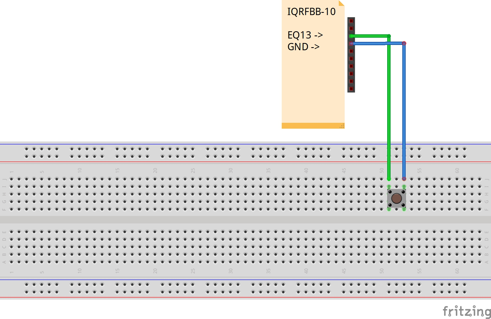

# Digital Input


This example shows how to detect DI on board. We will detect connection EQ13 pin to GRND. DI status is tested by testing software via reading all inputs.

## Links

* [IQRFBB-10 Datasheet](../../IQRFBB10-Datasheet.md)

## Prerequisities

1. **IQRFBB-10** bonded in working IQRF network. More in [GettingStarted with IQRFBB-10](https://github.com/logimic/iqrfboard/wiki)
2. **IQRF Gateway Daemon** running. More in [IQRF Gateway Daemon](https://github.com/logimic/iqrfboard/wiki/IQRF-Gateway-Daemon)
3. **Python 3.6 with WebSockets module**. More in [Python 3.6 WbSockets example](https://github.com/logimic/iqrfboard/wiki/Get-IQRF-with-your-software#python-36-websocket-example)

## Hardware wiring


_Fig.: IQRFBB10 schema_



_Fig.: External LED wiring_

Connect EQ13 and GRND pins via button.

## Software

* We use Standard DPA handler already loaded in board TR module.
* Testing software:
  - Set EQ13 as DI. EQ13 is **Q13/RE3** pin on TR-76DA.
  - Ask user to press an hold button
  - Wait 3sec
  - Read all DI
  - Parse response and make decision

### API JSON message

We will use pure DPA messages handled via [Daemon JSON API](https://docs.iqrfsdk.org/iqrf-gateway-daemon/):

* [RawHdp request  v1-0-0](https://apidocs.iqrf.org/iqrf-gateway-daemon/json/#iqrf/iqrfRawHdp-request-1-0-0.json), [..example](https://apidocs.iqrf.org/iqrf-gateway-daemon/json/iqrf/examples/iqrfRawHdp-request-1-0-0-example.json)
* [RawHdp response  v1-0-0](https://apidocs.iqrf.org/iqrf-gateway-daemon/json/#iqrf/iqrfRawHdp-response-1-0-0.json), [..example](https://apidocs.iqrf.org/iqrf-gateway-daemon/json/iqrf/examples/iqrfRawHdp-response-1-0-0-example.json)

**DPA commands:**

| NADR | PNUM | PCMD | HWPID |  PDATA   | What                       |
|:----:|:----:|:----:|:-----:|:--------:| -------------------------- |
| XXXX |  09  |  00  | FFFF  | 10.08.08 | Set RE3 (Address E3) as DI |
| XXXX |  09  |  02  | FFFF  |          | Read all DI pins           |

* _NADR: must be your address of IQRFBB-10 in IQRF network._
* _Numbers in table are in hex format._

### Testing Software

The [example-di.py](example-di.py) code:

```py
#
# Copyright 2018 Logimic,s.r.o.
# www.logimic.com
#
# Licensed under the Apache License, Version 2.0 (the "License");
# you may not use this file except in compliance with the License.
# You may obtain a copy of the License at
#
#     http://www.apache.org/licenses/LICENSE-2.0
#
# Unless required by applicable law or agreed to in writing, software
# distributed under the License is distributed on an "AS IS" BASIS,
# WITHOUT WARRANTIES OR CONDITIONS OF ANY KIND, either express or implied.
# See the License for the specific language governing permissions and
# limitations under the License.
#

# Websockets example-di.py
import asyncio
import websockets
import json
import time

# This is IQRFBB-10 node address in IQRF network
boardAddr = 3

# JSON messages by "https://docs.iqrfsdk.org/iqrf-gateway-daemon/api.html"
EQ13_IN = {
  "mType": "iqrfRawHdp",
  "data": {
    "msgId": "testRawHdp",
    "req": {
      "nAdr": boardAddr,
      "pNum": 9,
      "pCmd": 0,
      "pData": [16, 8, 8]
    },
    "returnVerbose": True
  }
}

READ_ALL = {
  "mType": "iqrfRawHdp",
  "data": {
    "msgId": "testRawHdp",
    "req": {
      "nAdr": boardAddr,
      "pNum": 9,
      "pCmd": 2
    },
    "returnVerbose": True
  }
}

async def hello():
    # Connect websockets
    async with websockets.connect(
            'ws://localhost:1338') as websocket:            

        # Set C1 OUT
        await websocket.send(json.dumps(EQ13_IN))
        print(f"Sent > {EQ13_IN}")

        response = await websocket.recv()
        print(f"Received < {response}")

        # Read all pins
        await websocket.send(json.dumps(READ_ALL))
        print(f"Sent > {READ_ALL}")        

        response = await websocket.recv()
        print(f"Received < {response}")         

        print("Connect EQ13 to GND...")

        # Wait 2 sec
        time.sleep(3)          

        # Read all pins again
        await websocket.send(json.dumps(READ_ALL))
        print(f"Sent > {READ_ALL}")        

        response = await websocket.recv()
        print(f"Received < {response}")                      

        # Parse JSON response
        data = json.loads(response)
        pData = data["data"]["rsp"]["pData"]
        button = pData[4]

        # Check input detection
        if button == 8:
          print(f"Input NOT detected: {button}")
        else:
          print(f"!!!Input detected: {button}")      

asyncio.get_event_loop().run_until_complete(hello())
```
