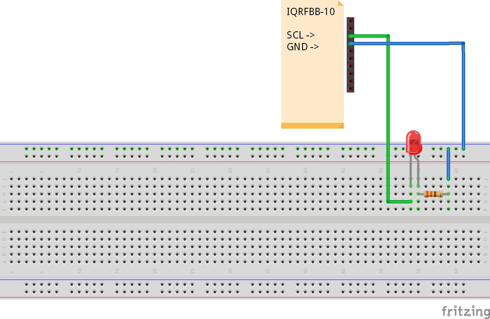

# Standard Binary Output

This example shows how to create "Standard Binary Output" e.g. relay which will be  immediately recognized and manageable from IOT world thanks to gateways and standardization.

Standardization does not limit your hardware creativity, your binary output can be relay, LED, or whatever else. In following example we will implement 5 binary outputs on the one board. They will control LED2, LED3, bi-stable relay (2 binary outputs needed) and one external LED.

## Links

* [IQRFBB-10 Datasheet](../../IQRFBB10-Datasheet.md)
* [IQRF Gateway Daemon Documentation](https://docs.iqrfsdk.org/iqrf-gateway-daemon/index.html)
* [IQRF Standards](https://www.iqrfalliance.org/techDocs/)

## Prerequisities

1. **IQRFBB-10** bonded in working IQRF network. More in [Getting Started](../../README.md)
2. **IQRF Gateway Daemon** working. More in [IQRF Gateway Daemon](../../IqrfGatewayDaemon.md)
3. **Python 3.6 with WebSockets module**. More in [Python WebSockets example](../../IqrfGatewayDaemon.md#python-websocket-example)

## Hardware wiring

Here is wiring of external LED connected to SCL/EX6 pin.

## Software in TR module

The [example-standardBinOutput.c](example-standardBinOutput.c) implements five binary outputs.
Please load this "Custom DPA Handler" to TR module on board. [Load Custom DPA Handler](../../SetupIqrfNetwork.md#load-custom-dpa-handler) manual.

## API JSON message

Since we implemented standard binary output we can use all standardized JSON messages for [Binary Output ](https://docs.iqrfsdk.org/iqrf-gateway-daemon/api.html#binaryoutput) via JSON API of gateways.

## Testing Python code

The [example-standardBinOutput.py](example-standardBinOutput.py) does following:

- Gets number of implemented binary outputs in TR module.
- LED2 = ON
- LED2 = OF, - LED3 = ON
- LED3 = OFF
- bi-stable relay = ON
- bi-stable relay = OFF
- External LED = ON
- External LED = OFF
