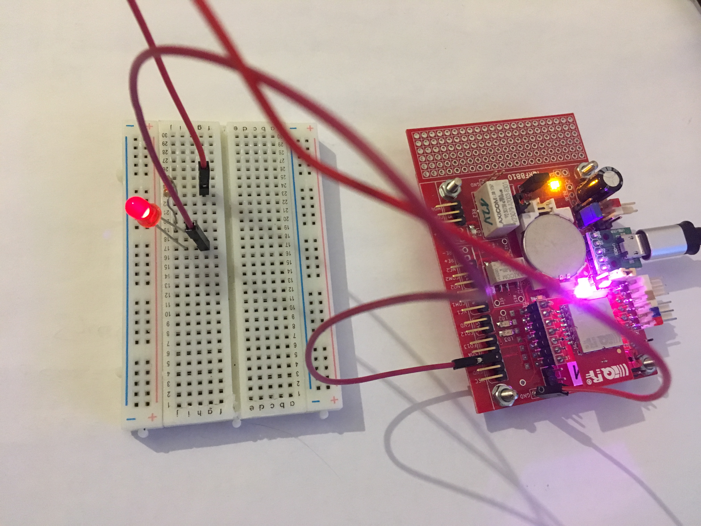

# Examples

### 1. LED2, LED3 on board

[/example-led23](example-led23), this example simple turns on/off RED and GREEN diods on the IQRFBB-10 board. This is first hello world example.

### 2. Digital Input

 [/example-di](example-di), this example shows how to detect digital input.

### 3. Digital Output

[/example-do](example-do), this example shows how to HI/LO digital output. The DO has connected external LED.

### 4. Hall Magnetic Sensor

[/example-hall](example-hall), this example shows how to connect Hall Magentic Sensor with the board and detect event.

### 5. Motion detection (ePir)

[/example-ePir](example-ePir), this example shows how to connect motion sensor ePir to the board and detect event.

### 6. Bi-stable relay on board

[/example-bistable-relay](example-bistable-relay), this example shows how to switch bi-stable relay on board.

### 7. Temperature & Barometric Pressure Sensor

Comming soon GY-BME280...
<!--
[/example-GY-BME280](example-GY-BME280), this example shows how to connect GY-BME280 Temperature and Barometric pressure sensor to board.
-->

### 8. Temperature & Humidity Sensor

Comming soon HTU21D...
<!--
[/example-HTU21D](example-HTU21D), this example shows how to connect GY-BME280 Temperature and Barometric pressure sensor to board.
-->

### 9. Ambient Light Sensor

Comming soon GY49...
<!--
[/example-GY-49](example-GY-49), this example shows how to connect GY-BME280 Temperature and Barometric pressure sensor to board.
-->
