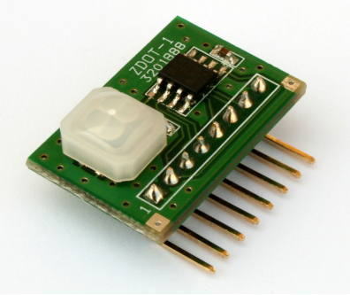

# Examples

#### 1. LED2, LED3 on board

First hello world example which turns on/off RED and GREEN diods on the IQRFBB-10 board.

[Enter example...](example-led23)

### 2. Standard Light

This example shows how to create "Standard light" from your board which means that entire world will know that your device is just a light and will be able to manage it (turn on/off, dim, get status and more). Your hardware design on the top of board is not limited...

[Enter example...](example-standardLight)

### 3. Digital Output

This example shows how to set HI/LO digital output. The DO has connected external LED.

[Enter example..](example-do)

### 4. Digital Input

This example explains how to detect digital input on board PIN.

[Enter example...](example-di),

### 5. Hall Magnetic Sensor

[/example-hall](example-hall), this example shows how to connect Hall Magentic Sensor with the board and detect event.

### 6. Motion detection (ePir)

[/example-ePir](example-ePir), this example shows how to connect motion sensor ePir to the board and detect event.

### 7. Bi-stable relay on board

[/example-bistable-relay](example-bistable-relay), this example shows how to switch bi-stable relay on board.

### 8. HTU21D - Temp & Humidity

Comming soon HTU21D...

[/example-HTU21D](example-HTU21D), this example shows how to connect HTU21D Temperature and Humidity sensor to board.

### 9. GY-BME280 - Temp & Baro

Comming soon GY-BME280...
<!--
[/example-GY-BME280](example-GY-BME280), this example shows how to connect GY-BME280 Temperature and Barometric pressure sensor to board.
-->

### 10. Ambient Light Sensor

Comming soon GY49...
<!--
[/example-GY-49](example-GY-49), this example shows how to connect GY-BME280 Temperature and Barometric pressure sensor to board.
-->
