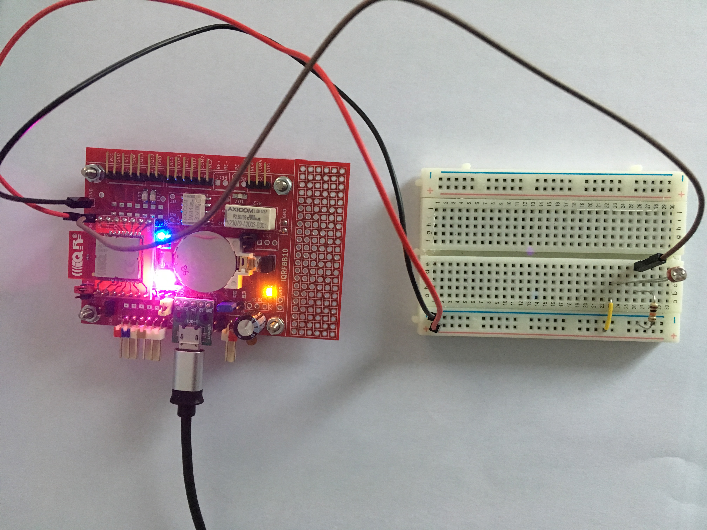

# Standard Photorezistor Sensor

This example shows how to create "Standard Photorezistor Sensor" that will be immediately recognized and manageable from IOT world thanks to gateways and standardization.

## Links

* [IQRFBB-10 Datasheet](../../IQRFBB10-Datasheet.md)
* [IQRF Gateway Daemon Documentation](https://docs.iqrfsdk.org/iqrf-gateway-daemon/index.html)
* [IQRF Standards](https://www.iqrfalliance.org/techDocs/)

## Prerequisities

1. **IQRFBB-10** bonded in working IQRF network. More in [Getting Started](../../README.md)
2. **IQRF Gateway Daemon** working. More in [IQRF Gateway Daemon](../../IqrfGatewayDaemon.md)
3. **Python 3.6 with WebSockets module**. More in [Python WebSockets example](../../IqrfGatewayDaemon.md#python-websocket-example)

## Hardware wiring

Photorezistor is connected to GND, VCC and EQ14/C1/AN0. Since the board has LED5 on EQ14, this LED will be indicating a work of photorezistor.

## Software in TR module

The [example-standardPhotorezistor.c](example-standardPhotorezistor) implements one binary input.
Please load this "Custom DPA Handler" to TR module on board. [Load Custom DPA Handler](../../SetupIqrfNetwork.md#load-custom-dpa-handler) manual.

## API JSON message

Since we implemented standard sensor we can use all standardized JSON messages for [Sensor ](https://docs.iqrfsdk.org/iqrf-gateway-daemon/api.html#sensor) via JSON API of gateways.

## Testing Python code

The [example-standardPhotorezistor.py](example-standardPhotorezistor.py) does following:

- Gets number of implemented standard sensors in TR module.
- Reads sensor in loop of 20 measurements
- Displays measured value from JSON message
