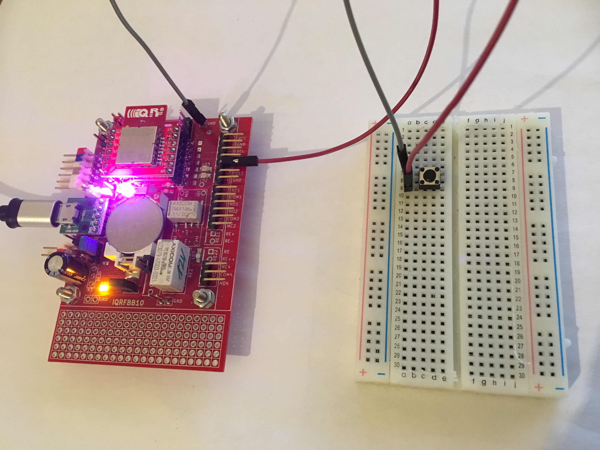
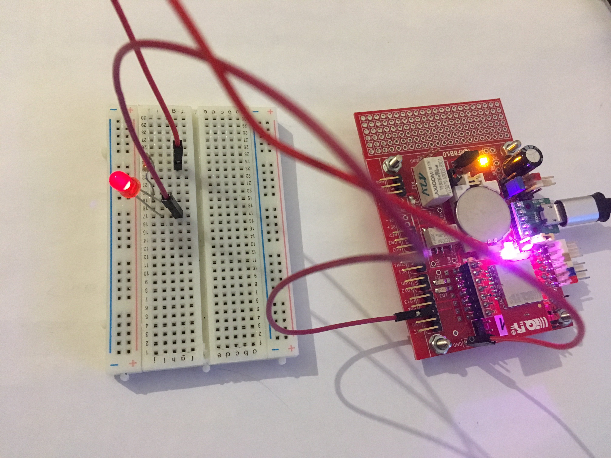
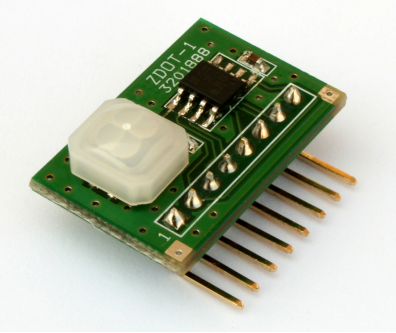

# Examples

### 1. LED2, LED3 on board

 [/example-led23](example-led23), this example simple turns on/off RED and GREEN diods on the IQRFBB-10 board. This is first hello world example.
   

### 2. Digital Input

 [/example-di](example-di), this example shows how to detect digital input.
  

### 3. Digital Output

[/example-do](example-do), this example shows how to HI/LO digital output. The DO has connected external LED.
  

### 4. Hall Magnetic Sensor

[/example-hall](example-hall), this example shows how to connect Hall Magentic Sensor with the board and detect event.
  

### 5. Motion detection (ePir)

[/example-ePir](example-ePir), this example shows how to connect motion sensor ePir to the board and detect event.
   

### 4. Bi-stable relay on board

[/example-bistable-relay](example-bistable-relay), this example shows how to switch bi-stable relay on board.
